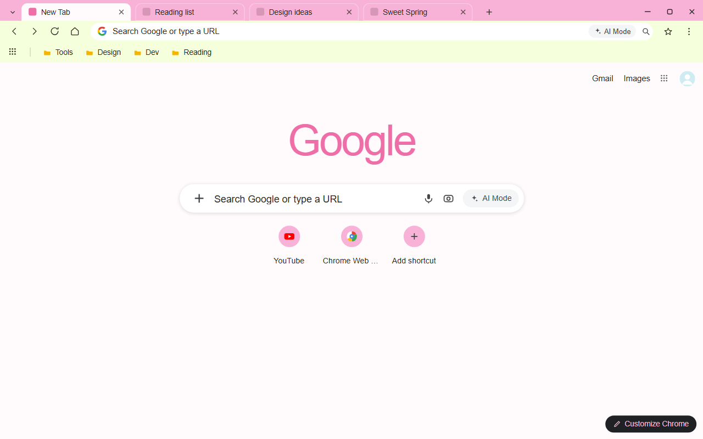
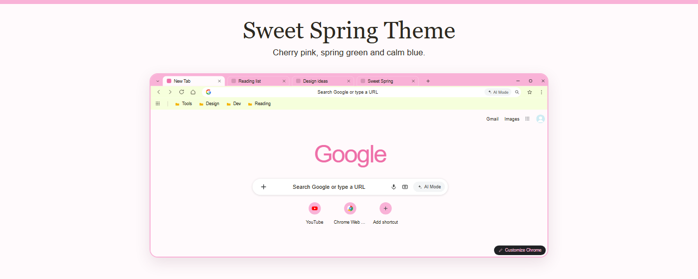
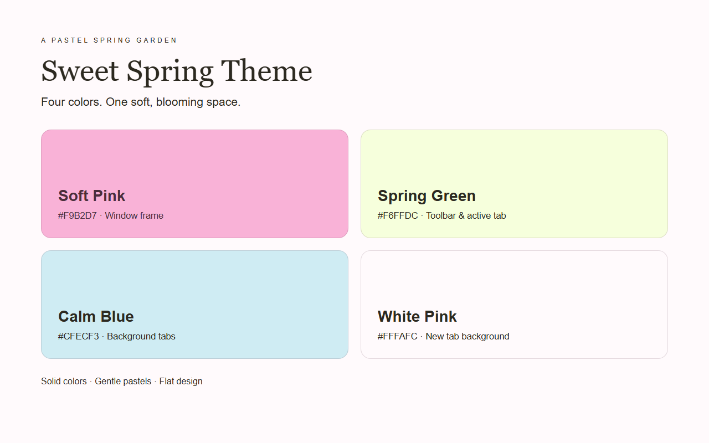

<p align="center">
  
</p>

<h1 align="center">Sweet Spring Theme</h1>

<p align="center">
  A soft pastel Chrome theme in sweet pink, fresh green, and calm blue.
</p>

<p align="center">
  
</p>

## Overview

Sweet Spring wraps your browser in a gentle spring palette: a sweet pink frame,
a fresh light-green toolbar, and calm blue background tabs, all sitting on a
near-white new tab page with a faint pink tint. It feels light, airy, and easy
on the eyes for everyday browsing.

The theme only recolors the parts of Chrome that themes are allowed to touch. It
does not recolor websites, does not replace the new tab page, and contains no
scripts, no tracking, and no permission requests.

## Palette

| Role | Hex | Used for |
|------|-----|----------|
| Sweet pink | `#F9B2D7` | top frame, active tab strip, window controls |
| Spring green | `#F6FFDC` | toolbar, active tab, bookmarks bar |
| Calm blue | `#CFECF3` | background (inactive) tabs |
| Mint | `#DAF9DE` | button background |
| White pink | `#FFFAFC` | new tab page background |
| Rose | `#A13F72` | new tab page links and header |

## Design

- A soft pastel palette inspired by early spring — pink blossom, fresh leaf, and
  clear sky blue.
- Solid colors only — no wallpaper, no patterns, no gradients.
- The active tab (spring green) is clearly separated from the pink frame.
- `ntp_logo_alternate` is enabled, so Chrome adapts the new tab page logo to the
  theme on its own; the exact tone is generated by Chrome.

## What you get

- A sweet pink top frame that ties the whole window together.
- A fresh light-green toolbar and bookmarks bar for a quiet, low-glare surface.
- Calm blue background tabs that stay readable behind the active one.
- A near-white, faintly pink new tab page for focus.
- Rose-colored links and header that keep the new tab page on-theme.

## Gallery

<p align="center">
  
</p>

<p align="center">
  
</p>

Screenshots and promo tiles are rendered by headless Chromium from plain HTML and
CSS using the exact manifest colors. They are illustrative layouts, not native
Chrome captures — load the theme to confirm the real result.

## Install (unpacked)

1. Open `chrome://extensions`
2. Enable **Developer mode** (top-right)
3. Click **Load unpacked** and select this folder
4. The theme applies immediately; reset it anytime under Settings → Appearance → Themes

## Files

- `manifest.json` — theme definition (manifest v3)
- `logo/logo128.png` — 128×128 icon used by both the theme and the store listing
- `store-assets/screenshots/en/` — 1280×800 English store screenshots
- `store-assets/promo/` — store promo tiles (440×280, 1400×560)
- `store-assets/references/` — headless Chromium source HTML and rendered PNGs
- `scripts/` — asset generation and packaging scripts

## Package

Requires Python and Pillow.

```bash
python scripts/build_zip.py
```

The script writes `sweet-spring-theme-v<version>.zip` (root contains
`manifest.json` + `logo/`) and copies it to `D:\迅雷下载\vibe coding`. Promo
tiles and screenshots ship inside the ZIP but still need to be uploaded
separately in the Chrome Web Store listing form.

## License

Non-Commercial License. Licensed for personal, non-commercial use; sharing with
attribution is welcome.
